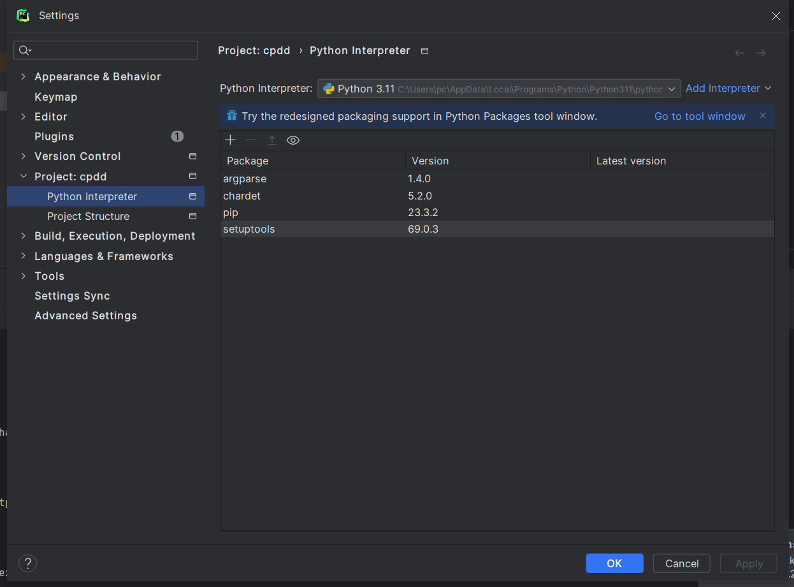

# CPDD - Copy Deep Designate

Copy Deep Designate 是项目深度克隆工具，用于从源项目工程进行深度复制，并自动为新克隆的项目分配新的项目代号和权限设置。

"Copy" 复制源项目或工程。"Deep" 进行深度复制，包括所有相关的文件和目录结构。"Designate" 指定或赋予新的项目代号或权限。


## 功能特性
* **深度复制**：全面复制源项目的所有文件和目录结构，确保新项目与源项目完全一致。
* **项目代号指定**：在复制完成后，自动为新项目分配一个新的项目代号，便于管理和区分不同的项目版本。

## 环境依赖


## 安装

### 使用`pip`安装

```shell
pip install cpdd
```

### 源代码安装

1. 克隆本仓库：
```shell
git clone https://github.com/edisonlil/cpdd.git
```
2. 进入项目目录：
```shell
cd cpdd
```
3. 安装依赖：

```shell
pip install -r requirements.txt
```
4. 安装工具：

```
python setup.py install
```
## 使用示例

基本用法
```shell
cpdd -d '<targetChars>:<sourceChars>,<targetChars>:<sourceChars>' -o <outputPath>  <sourcePath>
```
**相关命令**

* `-h --help`：查看帮助命令
* `-o`：新项目输出路径
* `-d`：替换字符KV形式

